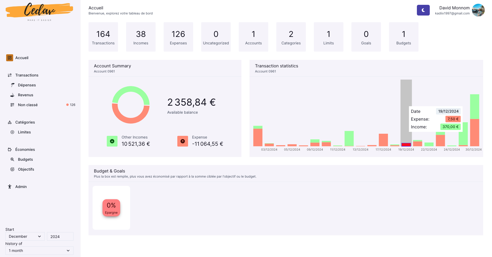
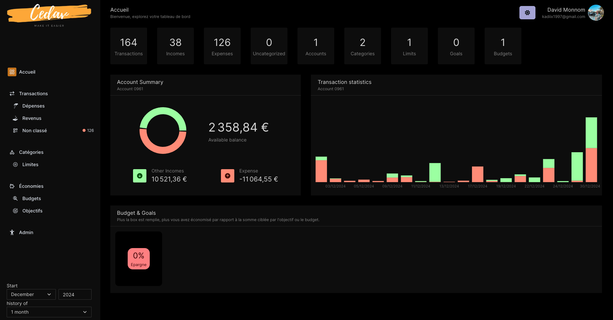
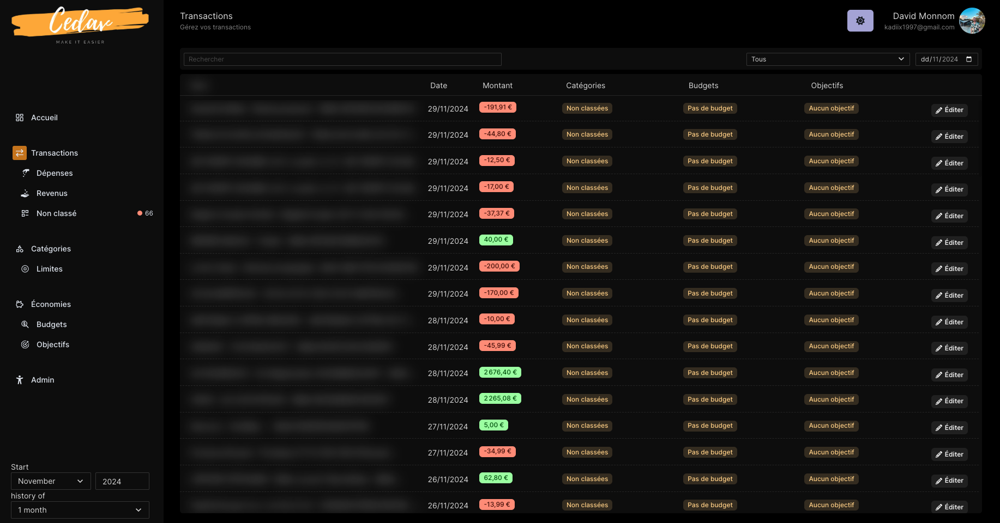
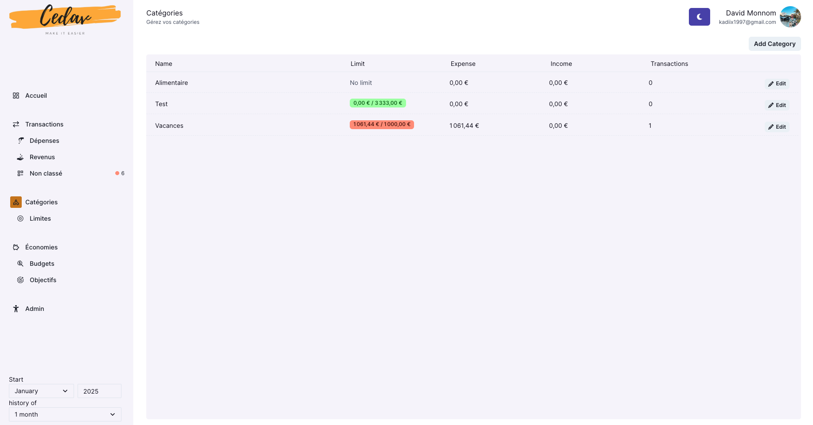
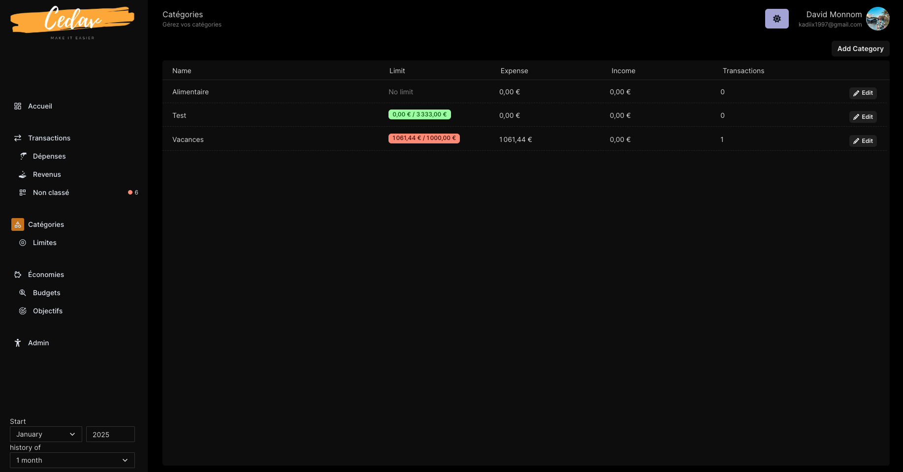
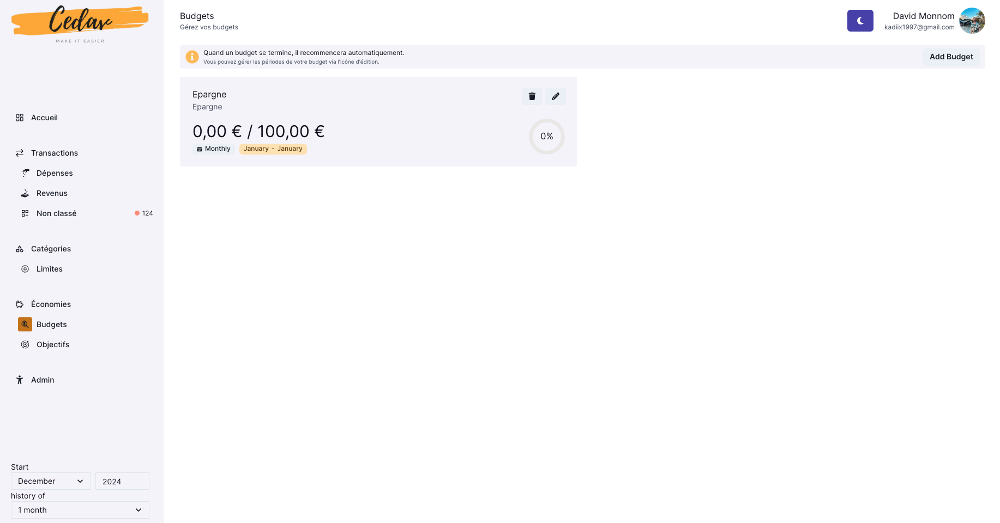
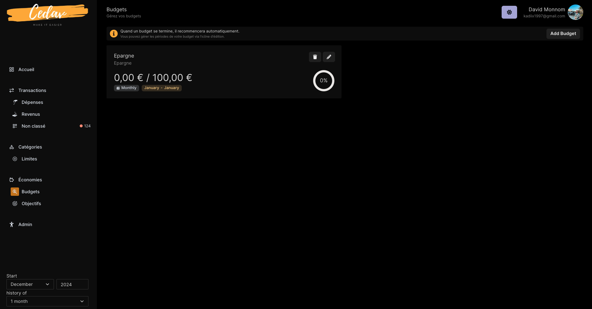

# CEDAV - Banking App

Banking application powered by NextJS and FastAPI. Connect in real time with your bank via Plaid APIs.

## Application
Functionalities:
- Directly connected to your bank account to fetch bank data
- Automatically categorizes transactions
- Budgeting tools
- Expense tracking by category
- Multiple accounts connected

Technologies:
- NextJS
- Chakra UI
- TypeScript
- Vercel
- Plaid API
- Python
- Supabase
- Prisma ORM

Backend Repository:
https://github.com/davidmonnom/banking-backend

---

Please note that this application is not yet in production. If you try to connect to it, you'll get an access error.
However, you can download it and add your own API identifier via Google & Plaid.

Here are the necessary environment variables to place in the .env file
```
NEXT_PUBLIC_API_URL=https://api.cedav.be
NEXT_PUBLIC_API_DOMAIN=cedav.be
```


## Screenshots
#### Dashboard
<p float="left">
  
  
</p>

#### Transaction
<p float="left">
  
  
</p>

#### Category
<p float="left">
  
  
</p>

#### Saving
<p float="left">
  
  
</p>

## Video
[](screenshots/cedav.mp4)
