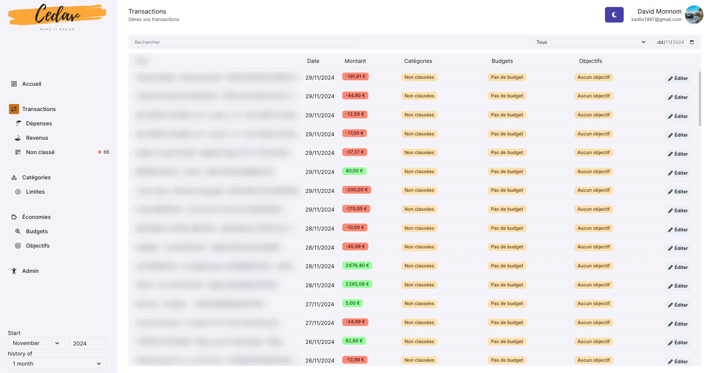

# CEDAV - Banking App

Banking application powered by NextJS and FastAPI. Connect in real time with your bank via Plaid APIs.

It lets you manage your budgets and spending categories, and several bank accounts can be connected at the same time and accessed by different users.


## Application
Functionalities:
- Directly connected to your bank account to fetch bank data
- Automatically categorizes transactions
- Budgeting tools
- Expense tracking by category
- Multiple accounts connected

Technologies:
- NextJS
- Chakra UI
- TypeScript
- Vercel
- Plaid API
- Python
- Supabase
- Prisma ORM

Backend Repository:
https://github.com/davidmonnom/banking-backend

---

Please note that this application is not yet in production. If you try to connect to it, you'll get an access error.
However, you can download it and add your own API identifier via Google & Plaid.

## Setup

Here are the necessary environment variables to place in the .env file
```
NEXT_PUBLIC_API_URL=https://api.cedav.be
NEXT_PUBLIC_API_DOMAIN=cedav.be
```

Install dependencies via npm with `npm install`.
Start the server with `npm run dev`.

Follow the backend server installation instructions.

## Screenshots
#### Dashboard
<p float="left">
  
  
</p>

#### Transaction
<p float="left">
  
  
</p>

#### Category
<p float="left">
  
  
</p>

#### Saving
<p float="left">
  
  
</p>

## Video
[](screenshots/cedav.mp4)
